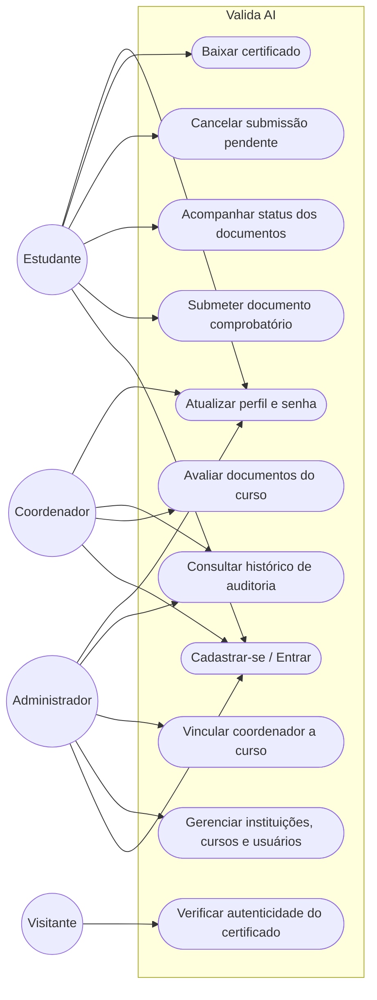
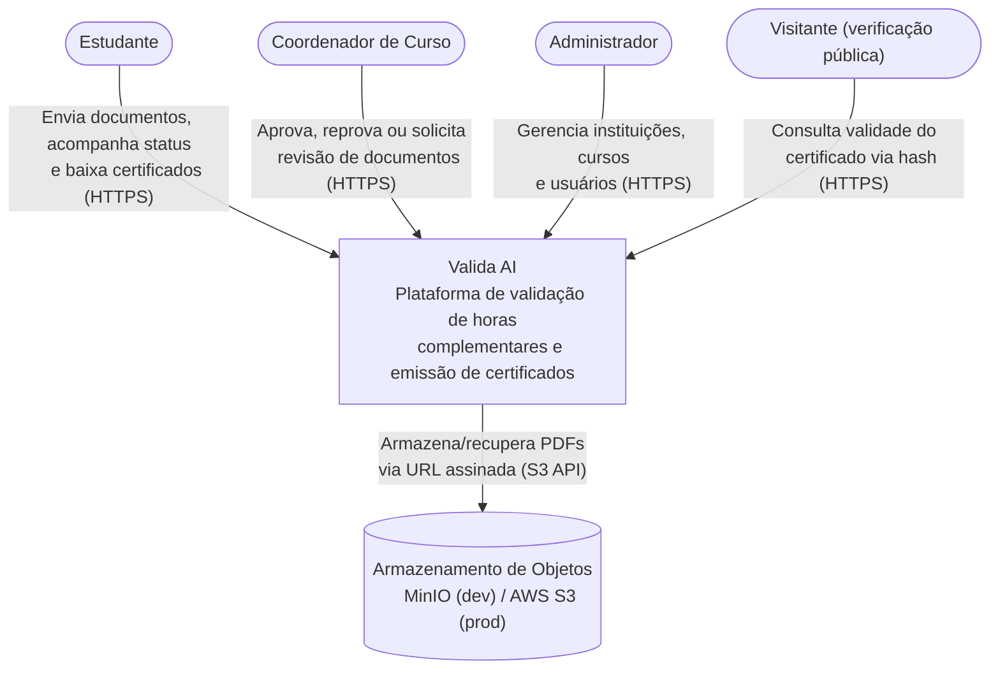
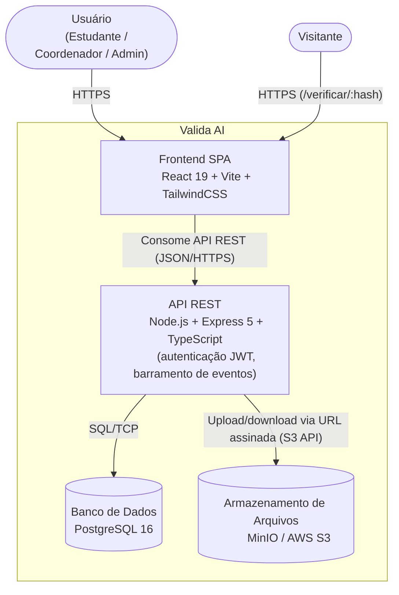

# Valida AI

 

## Resumo

O **Valida AI** é uma aplicação web voltada para **instituições de ensino** que precisam validar o cumprimento de **horas complementares acadêmicas** (cursos, eventos, monitorias, artigos, estágios extracurriculares etc.) por parte de seus estudantes. O sistema permite que estudantes **submetam comprovantes em PDF**, que **coordenadores de curso avaliem** (aprovando, reprovando ou solicitando revisão) e que, ao final, seja **emitido automaticamente um certificado em PDF com QR Code**, verificável publicamente sem necessidade de login. Sua arquitetura é baseada em **Node.js/Express, React e PostgreSQL**, com armazenamento de arquivos compatível com S3 (MinIO/AWS), autenticação **JWT** e controle de acesso por papéis (estudante, coordenador, administrador).

---

## 1. Introdução

### Contexto

Instituições de ensino superior costumam exigir que estudantes cumpram uma carga horária de **atividades complementares** para colação de grau. Na prática, esse processo é frequentemente manual: o estudante entrega comprovantes em papel ou por e-mail, e a coordenação avalia "na unha", sem um fluxo padronizado, sem histórico de decisões e sem um meio simples de comprovar a autenticidade do certificado emitido posteriormente. Falhas nesse processo administrativo comprometem a rastreabilidade das informações e podem gerar retrabalho tanto para estudantes quanto para coordenadores.

### Justificativa

A proposta do Valida AI é fundamentada em três pilares:

- **Eficiência**: substitui o fluxo manual (e-mails, planilhas, papel) por um painel único, com submissão, triagem e aprovação digitais.
- **Transparência**: cada decisão de aprovação/reprovação/solicitação de revisão fica registrada em um histórico de auditoria (`historico_validacoes`), e certificados emitidos podem ser conferidos publicamente via QR Code.
- **Segurança e Controle de Acesso**: autenticação via JWT, senhas com hash `bcrypt`, perfis de acesso (`estudante`, `coordenador`, `admin`) e validação de domínio de e-mail institucional por curso/instituição.

### Objetivos

#### Objetivo Principal

Disponibilizar uma plataforma web para gestão do processo de validação de horas complementares acadêmicas, cobrindo desde o cadastro de instituições/cursos/usuários até a submissão de comprovantes, avaliação por coordenadores e emissão automática de certificados verificáveis.

#### Metas

- Implementar autenticação segura e controle de acesso baseado em papéis (RBAC).
- Disponibilizar um painel para estudantes acompanharem o status de seus documentos e certificados.
- Permitir que coordenadores avaliem documentos restritos aos cursos sob sua responsabilidade.
- Gerar automaticamente certificados em PDF com QR Code de verificação ao aprovar um documento.
- Disponibilizar uma página pública de verificação de autenticidade de certificados.
- Garantir execução em containers (Docker) tanto em desenvolvimento quanto em produção.

---

## 2. Descrição do Projeto

### Tema

Sistema web para gestão do processo de validação de horas complementares acadêmicas, com submissão de comprovantes, triagem por coordenadores e emissão automática de certificados verificáveis.

### Problemas Resolvidos

- **Falta de rastreabilidade**: cada documento submetido passa por um fluxo de status (`pendente` → `aprovado` / `reprovado` / `revisao_solicitada` / `cancelado`) com histórico completo de quem avaliou e quando.
- **Conflito de organização entre cursos/instituições**: o modelo multi-tenant (instituições → cursos → usuários, com domínios de e-mail por instituição/curso) garante que cada coordenador veja apenas os documentos dos cursos que coordena.
- **Dificuldade de comprovação posterior**: certificados emitidos possuem um hash SHA-256 único, verificável publicamente em `/verificar/:hash` (sem necessidade de login), com QR Code embutido no PDF.
- **Centralização do cadastro**: o auto-cadastro de estudantes valida o domínio de e-mail institucional contra os domínios cadastrados para o curso/instituição (`dominios_email`), evitando cadastros fora do público-alvo.

---

## 3. Especificação Técnica

### Requisitos Funcionais (RF)

| ID | Descrição |
| ---- | ----------- |
| RF01 | Permitir o auto-cadastro de estudantes (fluxo de 4 etapas: nome → universidade/curso/turno → e-mail institucional/matrícula → senha), validando o domínio de e-mail contra os domínios cadastrados para o curso/instituição. |
| RF02 | Permitir login com e-mail e senha, emitindo um token JWT contendo perfil, curso(s) e instituição do usuário. |
| RF03 | Permitir que estudantes submetam documentos comprobatórios em PDF (até 10 MB), classificados em tipos pré-definidos (`certificado_curso`, `certificado_evento`, `declaracao_participacao`, `comprovante_atividade`, `artigo_publicado`, `outro`). |
| RF04 | Listar e filtrar documentos por status, tipo, estudante e curso, com paginação e controle de acesso por perfil (estudante vê os próprios; coordenador vê os dos cursos que coordena; admin vê todos). |
| RF05 | Permitir que coordenadores/administradores aprovem, reprovem (com observações obrigatórias) ou solicitem revisão de documentos submetidos. |
| RF06 | Permitir que o estudante cancele a submissão de um documento, desde que ainda esteja com status `pendente`. |
| RF07 | Gerar automaticamente um certificado em PDF (com QR Code de verificação) quando um documento é aprovado, disparado pelo evento `documento_aprovado`. |
| RF08 | Disponibilizar endpoint público (sem autenticação) para verificação de autenticidade de certificados a partir de um hash SHA-256 único. |
| RF09 | Permitir o download de documentos originais e de certificados via URL assinada temporária (armazenamento compatível com S3). |
| RF10 | Permitir que administradores realizem CRUD de instituições, incluindo definição dos domínios de e-mail aceitos. |
| RF11 | Permitir que administradores realizem CRUD de cursos vinculados a instituições, incluindo turno, modalidade e carga horária complementar exigida. |
| RF12 | Permitir que administradores realizem CRUD de usuários, incluindo ativação/desativação de contas (com proteção contra autodesativação). |
| RF13 | Permitir o vínculo N:N entre coordenadores e cursos, possibilitando que um coordenador responda por mais de um curso. |
| RF14 | Permitir que qualquer usuário autenticado atualize seu próprio perfil (nome, e-mail, matrícula, CPF, endereço) e troque sua senha mediante confirmação da senha atual. |
| RF15 | Manter um histórico de auditoria (`historico_validacoes`) para cada decisão tomada sobre um documento. |

### Requisitos Não Funcionais (RNF)

| ID | Descrição |
| ---- | ----------- |
| RNF01 | Autenticação stateless via JWT (segredo e tempo de expiração configuráveis via variáveis de ambiente) e senhas armazenadas com hash `bcrypt`. |
| RNF02 | Controle de acesso baseado em papéis (RBAC) através de middlewares (`autenticar` e `exigirPerfil`), com perfis `estudante`, `coordenador` e `admin`. |
| RNF03 | Armazenamento de arquivos (documentos e certificados) em serviço compatível com a API S3 — MinIO em desenvolvimento, AWS S3 em produção. |
| RNF04 | Persistência em banco de dados relacional **PostgreSQL 16**, com schema versionado (`infra/banco.sql`) e migrações incrementais para bancos pré-existentes. |
| RNF05 | Execução totalmente containerizada via **Docker** e **Docker Compose**, tanto para o ambiente de desenvolvimento (Postgres, Redis, MinIO) quanto para produção (Nginx, Certbot, frontend, backend, Postgres, Redis). |
| RNF06 | Pipeline de **CI/CD** via GitHub Actions, executando testes automatizados com cobertura para backend e frontend, análise estática via **SonarCloud**, build/push de imagens Docker e deploy automatizado por SSH em produção. |
| RNF07 | Comunicação criptografada (HTTPS) em produção, via Nginx com TLS 1.2/1.3, cabeçalho HSTS e renovação automática de certificados (Certbot/Let's Encrypt). |
| RNF08 | Cabeçalhos de segurança HTTP via `helmet` e política de CORS restrita por allowlist configurável (`CORS_ORIGIN`). |
| RNF09 | Validação de dados de entrada utilizando `zod` nas rotas da API. |
| RNF10 | Processamento assíncrono orientado a eventos (barramento baseado em `EventEmitter`) para desacoplar a geração de certificados e notificações da requisição HTTP original. |

---

## 4. Stack Tecnológica e Considerações de Design

### Considerações de Design

- **Arquitetura modular por domínio (backend)**: o backend é organizado em módulos (`auth`, `usuarios`, `documentos`, `validacao`, `certificados`, `cursos`, `instituicoes`), cada um com suas próprias rotas, repositórios e regras de negócio.
- **API RESTful**: comunicação entre o frontend (React) e o backend (Express) via JSON sobre HTTP(S), com autenticação `Bearer <token>`.
- **Arquitetura orientada a eventos**: transições de status de documentos disparam eventos (`documento_submetido`, `documento_aprovado`, `documento_reprovado`, `documento_revisao_solicitada`) processados por *handlers* dedicados — por exemplo, a geração do certificado ocorre de forma assíncrona ao evento `documento_aprovado`, sem bloquear a resposta da requisição que aprovou o documento.
- **Multi-tenancy hierárquico**: `instituicoes` → `cursos` → `usuarios`, com `dominios_email` (array) restringindo quais domínios de e-mail podem se cadastrar/logar em cada curso/instituição.
- **Deploy em containers com proxy reverso**: em produção, um container Nginx (`nginx-proxy`) faz terminação TLS e encaminha requisições para os containers `frontend` (Nginx servindo o build estático do React) e `backend` (API Express).
- **Acesso a dados via SQL direto**: o backend utiliza o driver `pg` (PostgreSQL) diretamente através de um `Pool` de conexões, com queries SQL explícitas nos repositórios — a dependência `knex` está presente no `package.json`, mas não é utilizada no código atual.

### Tecnologias Utilizadas

| Camada | Tecnologias |
| -------- | ------------- |
| Linguagem | TypeScript (backend e frontend) |
| Backend | Node.js, Express 5, JWT (`jsonwebtoken`), `bcryptjs`, `zod`, `helmet`, `multer`, `pdfkit`, `qrcode`, `winston` |
| Frontend | React 19, Vite, TailwindCSS 4, React Router 7, React Hook Form, TanStack Query, Axios |
| Banco de Dados | PostgreSQL 16 (driver `pg`) |
| Armazenamento de Arquivos | MinIO (desenvolvimento) / AWS S3 (produção), via `@aws-sdk/client-s3` |
| Containerização | Docker, Docker Compose |
| Proxy/Infra de Produção | Nginx, Certbot (Let's Encrypt) |
| CI/CD | GitHub Actions |
| Qualidade de Código | ESLint, Prettier, SonarCloud |
| Testes | Jest + Supertest + ts-jest (backend), Vitest + Testing Library + jsdom (frontend) |
| Cache (provisionado, sem uso identificado no código) | Redis |

---

## 5. Diagramas de Caso de Uso (UML)

---

## 6. Modelagem C4

### Nível 1 — Diagrama de Contexto

### Nível 2 — Diagrama de Containers

### Nível 3/4 — Componentes e Código

- **Componentes do backend**: cada módulo de domínio (`auth`, `usuarios`, `documentos`, `validacao`, `certificados`, `cursos`, `instituicoes`) expõe rotas próprias e é registrado em `aplicativo.ts`. O **barramento de eventos** (`eventos/barramento.ts`) desacopla a geração de certificados (`servicos/gerador-certificado.ts`) e notificações (`servicos/notificacao.ts`) das rotas de validação.
- **Componentes do frontend**: páginas em `frontend/src/pages` (ex.: `Login`, `Cadastro`, `Documentos`, `Certificados`, `Usuarios`, `Cursos`, `Instituicoes`, `Verificar`), contextos (`AuthContext`, `ThemeProvider`, `ToastProvider`) e um cliente Axios centralizado (`services/api.ts`) com interceptores de autenticação.
- **Código**: backend em TypeScript com tipagem de eventos (`eventos/tipos.ts`) e payload JWT (`PayloadJWT`); frontend em TypeScript com tipos de domínio centralizados em `frontend/src/types`.

---

## 7. Considerações de Segurança

- **Senhas**: armazenadas com hash `bcrypt` (nunca em texto plano); a troca de senha exige confirmação da senha atual.
- **Autenticação**: tokens JWT assinados com segredo obrigatório (`JWT_SECRET`), com tempo de expiração configurável (`JWT_EXPIRES_IN`).
- **Autorização**: middlewares `autenticar` (valida o token) e `exigirPerfil` (RBAC) protegem rotas por perfil (`estudante`, `coordenador`, `admin`).
- **Multi-tenancy / domínios de e-mail**: cadastro e login validam o e-mail informado contra os domínios autorizados (`dominios_email`) do curso/instituição, e o acesso a documentos é restrito por propriedade (estudante) ou por curso coordenado (`verificarAcessoDocumento`).
- **Cabeçalhos HTTP**: `helmet` aplicado globalmente; CORS restrito a uma allowlist configurável via `CORS_ORIGIN`.
- **Validação de entrada**: uso de `zod` para validar payloads recebidos pela API.
- **Transporte em produção**: HTTPS obrigatório via Nginx, com TLS 1.2/1.3, cifras modernas e cabeçalho HSTS (`max-age=63072000`); renovação automática de certificados via Certbot/Let's Encrypt.
- **Containers**: imagens de produção (backend e frontend) executam com usuário não-root (`Dockerfile`).
---

## 8. Referências

### Frameworks e Bibliotecas

- [Express](https://expressjs.com/)
- [React](https://react.dev/)
- [Vite](https://vite.dev/)
- [TailwindCSS](https://tailwindcss.com/)
- [PostgreSQL](https://www.postgresql.org/)
- [Docker](https://www.docker.com/)
- [GitHub Actions](https://github.com/features/actions)
- [JWT (jsonwebtoken)](https://github.com/auth0/node-jsonwebtoken)
- [Zod](https://zod.dev/)
- [pdfkit](https://pdfkit.org/)

### Segurança e Qualidade

- [OWASP Top 10](https://owasp.org/www-project-top-ten/)
- [SonarCloud](https://sonarcloud.io/project/overview?id=icrcode_valida-ai)
- [LGPD – Lei nº 13.709/2018](https://www.gov.br/cidadania/pt-br/acesso-a-informacao/lgpd)

### Licença

Este projeto está licenciado sob os termos da **Apache License 2.0** (ver arquivo `LICENSE` na raiz do repositório).

---

## 9. Informações de Autoria

**icrcode**

- Autor: [Ícaro Caldeira Botelho](https://github.com/icrcode)
- Revisor: [Gustavo Henrique Martins](https://github.com/gtins)
- Curso/Instituição/Orientador(a): Engenharia de Software / [Católica SC](https://github.com/CatolicaSC-Portfolio) / [Diogo Winck](https://github.com/dvwinck)
